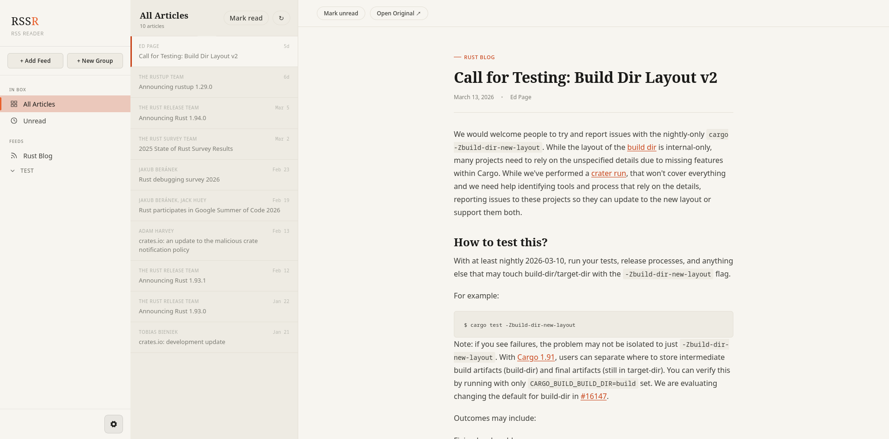

# RSS Reader (RSSR)

A modern RSS/Atom Reader built with Rust, featuring both a command-line interface (CLI) and web UI.


## Features

- Modern Web UI — responsive and easy to use
- CLI Interface — full command-line support
- SQLite Storage — local database for feeds and articles
 
## Installation
### Prerequisites

- Rust 1.70+ and Cargo
- Bun
- SQLite (usually included with Rust toolchain)

### Build from Source

```bash
git clone <repository-url>
cd rssr
cargo build --release
```

The binary will be located at `target/release/rssr`.

## Usage

### CLI Commands

#### Add a Feed (RSS or Atom)
```bash
# RSS feed
rssr add https://example.com/feed.xml

# Atom feed
rssr add https://example.com/atom.xml
```

#### List All Feeds
```bash
rssr list
```

#### Read Articles
```bash
# Read all articles
rssr read

# Read articles from a specific feed
rssr read 1

# Read only unread articles
rssr read --unread
```

#### Update Feeds
```bash
# Update all feeds
rssr update

# Update a specific feed
rssr update 1
```

#### Mark Article as Read/Unread
```bash
# Mark as read (default)
rssr mark 5

# Mark as unread
rssr mark 5 --unread
```

#### Delete a Feed
```bash
rssr delete 1
```

#### Start Web UI Server
```bash
# Start on default port 8080
rssr serve

# Start on custom port
rssr serve --port 3000
```

Then open `http://localhost:8080` in your browser.

## API Endpoints

The web server exposes the following REST API endpoints:

- `GET /api/feeds` - Get all feeds
- `POST /api/feeds` - Add a new feed
- `DELETE /api/feeds/{id}` - Delete a feed
- `POST /api/feeds/{id}/update` - Update a feed
- `GET /api/articles` - Get articles (supports `feed_id` and `unread_only` query params)
- `POST /api/feeds/{id}/{action}` - Mark feed as read/unread
- `POST /api/articles/{id}/{action}` - Mark article as read/unread
- `GET /api/stats` - Get feed statistics


## License

This project is open source and available under the MIT License.

## Contributing

Contributions are welcome! Please feel free to submit a Pull Request.
